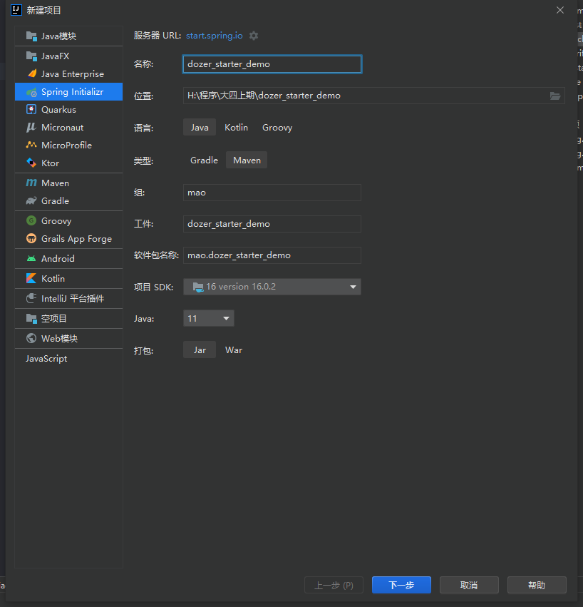
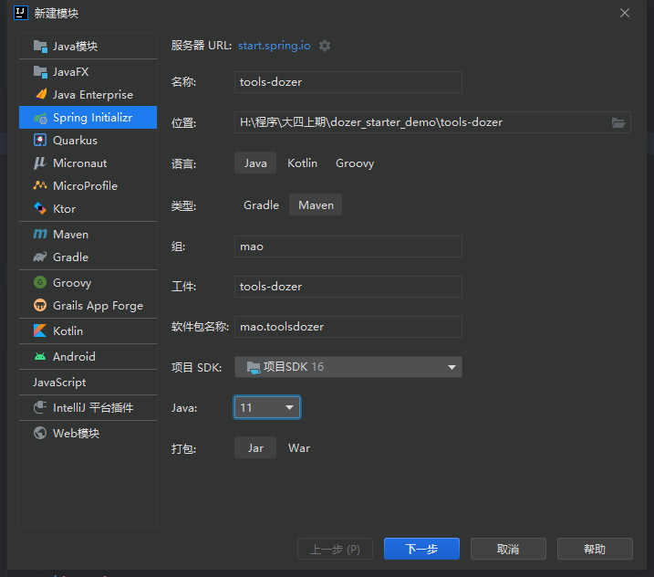

# docker

## 介绍

Dozer是Java Bean到Java Bean映射器，它以递归方式将数据从一个对象复制到另一个对象。 dozer是用来对两个对象之间属性转换的工具，有了这个工具之后，我们将一个对象的所有属性值转给另一个对象时，就不需要再去写重复的调用set和get方法了。dozer其实是对我们熟知的beanutils的封装


dozer的maven坐标：

```xml
<dependency>
    <groupId>com.github.dozermapper</groupId>
    <artifactId>dozer-core</artifactId>
    <version>6.5.0</version>
</dependency>
```


为了简化使用方式，dozer还提供了starter，其maven坐标为：

```xml
<dependency>
    <groupId>com.github.dozermapper</groupId>
    <artifactId>dozer-spring-boot-starter</artifactId>
    <version>6.5.0</version>
</dependency>
```


## dozer入门案例


### 第一步：创建项目dozer_demo


### 第二步：修改pom文件


```xml
<?xml version="1.0" encoding="UTF-8"?>
<project xmlns="http://maven.apache.org/POM/4.0.0" xmlns:xsi="http://www.w3.org/2001/XMLSchema-instance"
         xsi:schemaLocation="http://maven.apache.org/POM/4.0.0 https://maven.apache.org/xsd/maven-4.0.0.xsd">
    <modelVersion>4.0.0</modelVersion>
    <parent>
        <groupId>org.springframework.boot</groupId>
        <artifactId>spring-boot-starter-parent</artifactId>
        <version>2.7.1</version>
        <relativePath/> <!-- lookup parent from repository -->
    </parent>
    <groupId>mao</groupId>
    <artifactId>dozer_demo</artifactId>
    <version>0.0.1-SNAPSHOT</version>
    <name>dozer_demo</name>
    <description>dozer_demo</description>

    <properties>
        <java.version>11</java.version>
    </properties>

    <dependencies>
        <dependency>
            <groupId>org.springframework.boot</groupId>
            <artifactId>spring-boot-starter-web</artifactId>
        </dependency>

        <dependency>
            <groupId>org.springframework.boot</groupId>
            <artifactId>spring-boot-starter-test</artifactId>
            <scope>test</scope>
        </dependency>

        <dependency>
            <groupId>com.github.dozermapper</groupId>
            <artifactId>dozer-spring-boot-starter</artifactId>
            <version>6.5.0</version>
        </dependency>

    </dependencies>

    <build>
        <plugins>
            <plugin>
                <groupId>org.springframework.boot</groupId>
                <artifactId>spring-boot-maven-plugin</artifactId>
            </plugin>
        </plugins>
    </build>

</project>
```


### 第三步：创建UserEntity


```java
package mao.dozer_demo.entity;

import java.util.Date;

/**
 * Project name(项目名称)：dozer_demo
 * Package(包名): mao.dozer_demo.entity
 * Class(类名): UserEntity
 * Author(作者）: mao
 * Author QQ：1296193245
 * GitHub：https://github.com/maomao124/
 * Date(创建日期)： 2022/10/28
 * Time(创建时间)： 19:37
 * Version(版本): 1.0
 * Description(描述)： 无
 */


public class UserEntity
{
    /**
     * id
     */
    private String id;
    /**
     * 名字
     */
    private String name;
    /**
     * 年龄
     */
    private int age;
    /**
     * 地址
     */
    private String address;
    /**
     * 生日
     */
    private Date birthday;


    /**
     * Instantiates a new User entity.
     */
    public UserEntity()
    {

    }

    /**
     * Instantiates a new User entity.
     *
     * @param id       the id
     * @param name     the name
     * @param age      the age
     * @param address  the address
     * @param birthday the birthday
     */
    public UserEntity(String id, String name, int age, String address, Date birthday)
    {
        this.id = id;
        this.name = name;
        this.age = age;
        this.address = address;
        this.birthday = birthday;
    }

    /**
     * Gets id.
     *
     * @return the id
     */
    public String getId()
    {
        return id;
    }

    /**
     * Sets id.
     *
     * @param id the id
     */
    public void setId(String id)
    {
        this.id = id;
    }

    /**
     * Gets name.
     *
     * @return the name
     */
    public String getName()
    {
        return name;
    }

    /**
     * Sets name.
     *
     * @param name the name
     */
    public void setName(String name)
    {
        this.name = name;
    }

    /**
     * Gets age.
     *
     * @return the age
     */
    public int getAge()
    {
        return age;
    }

    /**
     * Sets age.
     *
     * @param age the age
     */
    public void setAge(int age)
    {
        this.age = age;
    }

    /**
     * Gets address.
     *
     * @return the address
     */
    public String getAddress()
    {
        return address;
    }

    /**
     * Sets address.
     *
     * @param address the address
     */
    public void setAddress(String address)
    {
        this.address = address;
    }

    /**
     * Gets birthday.
     *
     * @return the birthday
     */
    public Date getBirthday()
    {
        return birthday;
    }

    /**
     * Sets birthday.
     *
     * @param birthday the birthday
     */
    public void setBirthday(Date birthday)
    {
        this.birthday = birthday;
    }

    @Override
    @SuppressWarnings("all")
    public String toString()
    {
        final StringBuilder stringbuilder = new StringBuilder();
        stringbuilder.append("id：").append(id).append('\n');
        stringbuilder.append("name：").append(name).append('\n');
        stringbuilder.append("age：").append(age).append('\n');
        stringbuilder.append("address：").append(address).append('\n');
        stringbuilder.append("birthday：").append(birthday).append('\n');
        return stringbuilder.toString();
    }
}
```


### 第四步：创建UserDTO


```java
package mao.dozer_demo.entity;

/**
 * Project name(项目名称)：dozer_demo
 * Package(包名): mao.dozer_demo.entity
 * Class(类名): UserDTO
 * Author(作者）: mao
 * Author QQ：1296193245
 * GitHub：https://github.com/maomao124/
 * Date(创建日期)： 2022/10/28
 * Time(创建时间)： 19:39
 * Version(版本): 1.0
 * Description(描述)： 无
 */


public class UserDTO
{
    /**
     * 用户id
     */
    private String userId;
    /**
     * 用户名
     */
    private String userName;
    /**
     * 用户年龄
     */
    private int userAge;
    /**
     * 地址
     */
    private String address;
    /**
     * 生日
     */
    private String birthday;

    /**
     * Instantiates a new User dto.
     */
    public UserDTO()
    {
    }

    /**
     * Instantiates a new User dto.
     *
     * @param userId   the user id
     * @param userName the user name
     * @param userAge  the user age
     * @param address  the address
     * @param birthday the birthday
     */
    public UserDTO(String userId, String userName, int userAge, String address, String birthday)
    {
        this.userId = userId;
        this.userName = userName;
        this.userAge = userAge;
        this.address = address;
        this.birthday = birthday;
    }

    /**
     * Gets user id.
     *
     * @return the user id
     */
    public String getUserId()
    {
        return userId;
    }

    /**
     * Sets user id.
     *
     * @param userId the user id
     */
    public void setUserId(String userId)
    {
        this.userId = userId;
    }

    /**
     * Gets user name.
     *
     * @return the user name
     */
    public String getUserName()
    {
        return userName;
    }

    /**
     * Sets user name.
     *
     * @param userName the user name
     */
    public void setUserName(String userName)
    {
        this.userName = userName;
    }

    /**
     * Gets user age.
     *
     * @return the user age
     */
    public int getUserAge()
    {
        return userAge;
    }

    /**
     * Sets user age.
     *
     * @param userAge the user age
     */
    public void setUserAge(int userAge)
    {
        this.userAge = userAge;
    }

    /**
     * Gets address.
     *
     * @return the address
     */
    public String getAddress()
    {
        return address;
    }

    /**
     * Sets address.
     *
     * @param address the address
     */
    public void setAddress(String address)
    {
        this.address = address;
    }

    /**
     * Gets birthday.
     *
     * @return the birthday
     */
    public String getBirthday()
    {
        return birthday;
    }

    /**
     * Sets birthday.
     *
     * @param birthday the birthday
     */
    public void setBirthday(String birthday)
    {
        this.birthday = birthday;
    }

    @Override
    @SuppressWarnings("all")
    public String toString()
    {
        final StringBuilder stringbuilder = new StringBuilder();
        stringbuilder.append("userId：").append(userId).append('\n');
        stringbuilder.append("userName：").append(userName).append('\n');
        stringbuilder.append("userAge：").append(userAge).append('\n');
        stringbuilder.append("address：").append(address).append('\n');
        stringbuilder.append("birthday：").append(birthday).append('\n');
        return stringbuilder.toString();
    }
}
```


### 第五步：在resources/dozer/目录下创建dozer的全局配置文件global.dozer.xml


```xml
<?xml version="1.0" encoding="UTF-8"?>
<mappings xmlns:xsi="http://www.w3.org/2001/XMLSchema-instance"
          xmlns="http://dozermapper.github.io/schema/bean-mapping"
          xsi:schemaLocation="http://dozermapper.github.io/schema/bean-mapping
                              http://dozermapper.github.io/schema/bean-mapping.xsd">
    <!--
    全局配置:
    <date-format>表示日期格式
     -->
    <configuration>
        <date-format>yyyy-MM-dd</date-format>
    </configuration>

    
</mappings>
```


### 第六步：在resources/dozer/目录下创建dozer的映射文件biz.dozer.xml


```xml
<mappings xmlns:xsi="http://www.w3.org/2001/XMLSchema-instance"
          xmlns="http://dozermapper.github.io/schema/bean-mapping"
          xsi:schemaLocation="http://dozermapper.github.io/schema/bean-mapping
                             http://dozermapper.github.io/schema/bean-mapping.xsd">

    <!--描述两个类中属性的对应关系，对于两个类中同名的属性可以不映射-->

    <mapping date-format="yyyy-MM-dd">
        <class-a>mao.dozer_demo.entity.UserEntity</class-a>
        <class-b>mao.dozer_demo.entity.UserDTO</class-b>

        <field>
            <a>id</a>
            <b>userId</b>
        </field>
        <field>
            <a>name</a>
            <b>userName</b>
        </field>
        <field>
            <a>age</a>
            <b>userAge</b>
        </field>
        
    </mapping>

    <mapping date-format="yyyy-MM-dd" map-id="user">
        <class-a>mao.dozer_demo.entity.UserEntity</class-a>
        <class-b>mao.dozer_demo.entity.UserDTO</class-b>

        <field>
            <a>id</a>
            <b>userId</b>
        </field>
        <field>
            <a>name</a>
            <b>userName</b>
        </field>
        <field>
            <a>age</a>
            <b>userAge</b>
        </field>
        
    </mapping>

    

</mappings>
```


### 第七步：编写配置类


```java
@Configuration
public class DozerMapperConfig
{
    @Bean
    public DozerBeanMapperFactoryBean dozerMapper(@Value("classpath:dozer/*.xml") Resource[] resources)
            throws IOException
    {
        DozerBeanMapperFactoryBean dozerBeanMapperFactoryBean = new DozerBeanMapperFactoryBean();
        dozerBeanMapperFactoryBean.setMappingFiles(resources);
        return dozerBeanMapperFactoryBean;
    }
}
```


### 第八步：编写单元测试类


```java
package mao.dozer_demo;

import com.github.dozermapper.core.Mapper;
import mao.dozer_demo.entity.UserDTO;
import mao.dozer_demo.entity.UserEntity;
import org.junit.jupiter.api.Test;
import org.slf4j.Logger;
import org.slf4j.LoggerFactory;
import org.springframework.beans.factory.annotation.Autowired;
import org.springframework.boot.test.context.SpringBootTest;

import java.util.Date;

/**
 * Project name(项目名称)：dozer_demo
 * Package(包名): mao.dozer_demo
 * Class(类名): DozerTest
 * Author(作者）: mao
 * Author QQ：1296193245
 * GitHub：https://github.com/maomao124/
 * Date(创建日期)： 2022/10/28
 * Time(创建时间)： 19:50
 * Version(版本): 1.0
 * Description(描述)： 无
 */

@SpringBootTest
public class DozerTest
{

    @Autowired
    private Mapper mapper;

    private static final Logger log = LoggerFactory.getLogger(DozerTest.class);

    @Test
    void test1()
    {
        UserDTO userDTO = new UserDTO();
        userDTO.setUserId("134");
        userDTO.setUserName("张三");
        userDTO.setUserAge(19);
        userDTO.setAddress("中国");
        userDTO.setBirthday("2012-10-13");

        log.info(userDTO.toString());

        UserEntity userEntity = mapper.map(userDTO, UserEntity.class);

        log.info(userEntity.toString());

    }

    @Test
    void test2()
    {
        UserEntity userEntity = new UserEntity("1234", "李四", 14, "中国", new Date());
        UserDTO userDTO = mapper.map(userEntity, UserDTO.class);

        log.info(userEntity.toString());
        log.info(userDTO.toString());
    }
}
```


测试1：

```sh
2022-10-28 20:32:37.318  INFO 15068 --- [           main] mao.dozer_demo.DozerTest                 : userId：134
userName：张三
userAge：19
address：中国
birthday：2012-10-13

2022-10-28 20:32:37.326  INFO 15068 --- [           main] mao.dozer_demo.DozerTest                 : id：134
name：张三
age：19
address：中国
birthday：Sat Oct 13 00:00:00 CST 2012
```


测试2：

```sh
2022-10-28 20:33:08.781  INFO 1252 --- [           main] mao.dozer_demo.DozerTest                 : id：1234
name：李四
age：14
address：中国
birthday：Fri Oct 28 20:33:08 CST 2022

2022-10-28 20:33:08.781  INFO 1252 --- [           main] mao.dozer_demo.DozerTest                 : userId：1234
userName：李四
userAge：14
address：中国
birthday：2022-10-28
```


## 自定义spring boot starter

### 开发starter


第一步：初始化项目


创建父工程dozer_starter_demo





创建子工程tools-dozer





创建子工程use-starter


第二步：修改pom文件


父工程dozer_starter_demo的pom文件：

```xml
<?xml version="1.0" encoding="UTF-8"?>
<project xmlns="http://maven.apache.org/POM/4.0.0" xmlns:xsi="http://www.w3.org/2001/XMLSchema-instance"
         xsi:schemaLocation="http://maven.apache.org/POM/4.0.0 https://maven.apache.org/xsd/maven-4.0.0.xsd">
    <modelVersion>4.0.0</modelVersion>

    <parent>
        <groupId>org.springframework.boot</groupId>
        <artifactId>spring-boot-starter-parent</artifactId>
        <version>2.7.1</version>
        <relativePath/> <!-- lookup parent from repository -->
    </parent>

    <groupId>mao</groupId>
    <artifactId>dozer_starter_demo</artifactId>
    <version>0.0.1-SNAPSHOT</version>
    <name>dozer_starter_demo</name>
    <description>dozer_starter_demo</description>
    <packaging>pom</packaging>

    <properties>
        <java.version>11</java.version>
    </properties>

    <modules>
        <module>tools-dozer</module>
        <module>use-starter</module>
    </modules>


    <dependencies>

    </dependencies>

    <dependencyManagement>

        <dependencies>

        </dependencies>

    </dependencyManagement>

    <build>
        <plugins>
            <plugin>
                <groupId>org.springframework.boot</groupId>
                <artifactId>spring-boot-maven-plugin</artifactId>
            </plugin>
        </plugins>
    </build>

</project>
```


子工程tools-dozer的pom文件：

```xml
<?xml version="1.0" encoding="UTF-8"?>
<project xmlns="http://maven.apache.org/POM/4.0.0" xmlns:xsi="http://www.w3.org/2001/XMLSchema-instance"
         xsi:schemaLocation="http://maven.apache.org/POM/4.0.0 https://maven.apache.org/xsd/maven-4.0.0.xsd">
    <modelVersion>4.0.0</modelVersion>

    <parent>
        <artifactId>dozer_starter_demo</artifactId>
        <groupId>mao</groupId>
        <version>0.0.1-SNAPSHOT</version>
    </parent>

    <artifactId>tools-dozer</artifactId>
    <version>0.0.1-SNAPSHOT</version>
    <name>tools-dozer</name>
    <description>tools-dozer</description>

    <properties>

    </properties>

    <dependencies>

        <dependency>
            <groupId>org.springframework.boot</groupId>
            <artifactId>spring-boot-starter-web</artifactId>
        </dependency>

        <dependency>
            <groupId>com.github.dozermapper</groupId>
            <artifactId>dozer-spring-boot-starter</artifactId>
            <version>6.5.0</version>
        </dependency>

        <!--spring boot starter开发依赖-->
        <dependency>
            <groupId>org.springframework.boot</groupId>
            <artifactId>spring-boot-starter</artifactId>
        </dependency>

        <dependency>
            <groupId>org.springframework.boot</groupId>
            <artifactId>spring-boot-autoconfigure</artifactId>
        </dependency>

        <dependency>
            <groupId>org.springframework.boot</groupId>
            <artifactId>spring-boot-configuration-processor</artifactId>
        </dependency>

    </dependencies>

    <build>
        <plugins>
            <plugin>
                <groupId>org.springframework.boot</groupId>
                <artifactId>spring-boot-maven-plugin</artifactId>
            </plugin>
        </plugins>
    </build>

</project>
```


子工程use-starter的pom文件：

```xml
<?xml version="1.0" encoding="UTF-8"?>
<project xmlns="http://maven.apache.org/POM/4.0.0" xmlns:xsi="http://www.w3.org/2001/XMLSchema-instance"
         xsi:schemaLocation="http://maven.apache.org/POM/4.0.0 https://maven.apache.org/xsd/maven-4.0.0.xsd">
    <modelVersion>4.0.0</modelVersion>

    <parent>
        <artifactId>dozer_starter_demo</artifactId>
        <groupId>mao</groupId>
        <version>0.0.1-SNAPSHOT</version>
    </parent>

    <artifactId>use-starter</artifactId>
    <version>0.0.1-SNAPSHOT</version>
    <name>use-starter</name>
    <description>use-starter</description>

    <properties>

    </properties>

    <dependencies>
        <dependency>
            <groupId>org.springframework.boot</groupId>
            <artifactId>spring-boot-starter-web</artifactId>
        </dependency>

        <dependency>
            <groupId>org.springframework.boot</groupId>
            <artifactId>spring-boot-starter-test</artifactId>
            <scope>test</scope>
        </dependency>

    </dependencies>

    <build>
        <plugins>
            <plugin>
                <groupId>org.springframework.boot</groupId>
                <artifactId>spring-boot-maven-plugin</artifactId>
            </plugin>
        </plugins>
    </build>

</project>
```


第三步：编写工具类DozerUtils


```java
package mao.toolsdozer.utils;

import com.github.dozermapper.core.Mapper;

import java.util.*;
import java.util.stream.Collectors;

/**
 * Project name(项目名称)：dozer_starter_demo
 * Package(包名): mao.toolsdozer.utils
 * Class(类名): DozerUtils
 * Author(作者）: mao
 * Author QQ：1296193245
 * GitHub：https://github.com/maomao124/
 * Date(创建日期)： 2022/10/28
 * Time(创建时间)： 21:57
 * Version(版本): 1.0
 * Description(描述)： 无
 */

public class DozerUtils
{
    private final Mapper mapper;

    public DozerUtils(Mapper mapper)
    {
        this.mapper = mapper;
    }

    public Mapper getMapper()
    {
        return this.mapper;
    }

    /**
     * 地图
     * Constructs new instance of destinationClass and performs mapping between from source
     *
     * @param source           源
     * @param destinationClass 目标类
     * @return {@link T}
     */
    public <T> T map(Object source, Class<T> destinationClass)
    {
        if (source == null)
        {
            return null;
        }
        return mapper.map(source, destinationClass);
    }

    /**
     * map2
     *
     * @param source           源
     * @param destinationClass 目标类
     * @return {@link T}
     */
    public <T> T map2(Object source, Class<T> destinationClass)
    {
        if (source == null)
        {
            try
            {
                return destinationClass.newInstance();
            }
            catch (Exception ignored)
            {
            }
        }
        return mapper.map(source, destinationClass);
    }

    /**
     * 地图
     * Performs mapping between source and destination objects
     *
     * @param source      源
     * @param destination 目地
     */
    public void map(Object source, Object destination)
    {
        if (source == null)
        {
            return;
        }
        mapper.map(source, destination);
    }

    /**
     * 
     * Constructs new instance of destinationClass and performs mapping between from source
     *
     * @param source           源
     * @param destinationClass 目标类
     * @param mapId            mapId
     * @return {@link T}
     */
    public <T> T map(Object source, Class<T> destinationClass, String mapId)
    {
        if (source == null)
        {
            return null;
        }
        return mapper.map(source, destinationClass, mapId);
    }

    /**
     * 
     * Performs mapping between source and destination objects
     *
     * @param source      源
     * @param destination 目标
     * @param mapId       mapId
     */
    public void map(Object source, Object destination, String mapId)
    {
        if (source == null)
        {
            return;
        }
        mapper.map(source, destination, mapId);
    }

    /**
     * 
     * 将集合转成集合
     * List<A> -->  List<B>
     *
     * @param sourceList       源集合
     * @param destinationClass 待转类型
     * @return {@link List}<{@link T}>
     */
    public <T, E> List<T> mapList(Collection<E> sourceList, Class<T> destinationClass)
    {
        return mapPage(sourceList, destinationClass);
    }


    public <T, E> List<T> mapPage(Collection<E> sourceList, Class<T> destinationClass)
    {
        if (sourceList == null || sourceList.isEmpty() || destinationClass == null)
        {
            return Collections.emptyList();
        }
        return sourceList.stream()
                .filter(Objects::nonNull)
                .map((sourceObject) -> mapper.map(sourceObject, destinationClass))
                .collect(Collectors.toList());
    }

    public <T, E> Set<T> mapSet(Collection<E> sourceList, Class<T> destinationClass)
    {
        if (sourceList == null || sourceList.isEmpty() || destinationClass == null)
        {
            return Collections.emptySet();
        }
        return sourceList.stream().map((sourceObject) -> mapper.map(sourceObject, destinationClass)).collect(Collectors.toSet());
    }
}
```


第四步：编写配置类DozerAutoConfiguration


```java
package mao.toolsdozer.config;

import com.github.dozermapper.core.Mapper;
import com.github.dozermapper.spring.DozerBeanMapperFactoryBean;
import mao.toolsdozer.utils.DozerUtils;
import org.springframework.beans.factory.annotation.Autowired;
import org.springframework.beans.factory.annotation.Value;
import org.springframework.boot.autoconfigure.condition.ConditionalOnMissingBean;
import org.springframework.context.annotation.Bean;
import org.springframework.context.annotation.Configuration;
import org.springframework.core.io.Resource;

import java.io.IOException;

/**
 * Project name(项目名称)：dozer_starter_demo
 * Package(包名): mao.toolsdozer.config
 * Class(类名): DozerAutoConfiguration
 * Author(作者）: mao
 * Author QQ：1296193245
 * GitHub：https://github.com/maomao124/
 * Date(创建日期)： 2022/10/28
 * Time(创建时间)： 22:03
 * Version(版本): 1.0
 * Description(描述)： 无
 */

@Configuration
public class DozerAutoConfiguration
{
    @Bean
    public DozerBeanMapperFactoryBean dozerMapper(@Value("classpath:dozer/*.xml") Resource[] resources)
            throws IOException
    {
        DozerBeanMapperFactoryBean dozerBeanMapperFactoryBean = new DozerBeanMapperFactoryBean();
        dozerBeanMapperFactoryBean.setMappingFiles(resources);
        return dozerBeanMapperFactoryBean;
    }

    @Bean
    @ConditionalOnMissingBean
    public DozerUtils getDozerUtils(@Autowired Mapper mapper)
    {
        return new DozerUtils(mapper);
    }
}
```


第五步：创建并编写spring.factories文件


```
org.springframework.boot.autoconfigure.EnableAutoConfiguration=\
  mao.toolsdozer.config.DozerAutoConfiguration
```


### 使用starter


